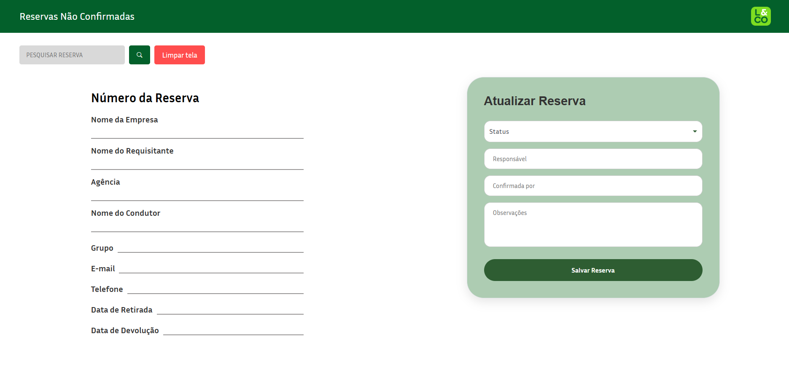

<h1 align="center">Sistema de Tratativa de Reservas Não Confirmadas</h1>

<p align="center">
  <a href="#sobre-o-projeto">Sobre o projeto</a>&nbsp;&nbsp;&nbsp;|&nbsp;&nbsp;&nbsp;
  <a href="#tecnologias-utilizadas">Tecnologias</a>&nbsp;&nbsp;&nbsp;|&nbsp;&nbsp;&nbsp;
  <a href="#como-executar">Execução</a>&nbsp;&nbsp;&nbsp;|&nbsp;&nbsp;&nbsp;
  <a href="#material">Documentação</a>&nbsp;&nbsp;&nbsp;|&nbsp;&nbsp;&nbsp;
  <a href="#layout">Layout</a>
</p>


<br>

<p align="center">
  
</p>

# Sobre o projeto

Aplicação Full Stack desenvolvida para consulta e tratamento operacional de reservas não confirmadas.

O sistema permite pesquisar reservas, visualizar seus detalhes e registrar ou atualizar as tratativas realizadas pela equipe responsável.

## Tecnologias utilizadas

### Frontend
- Angular 18
- TypeScript
- SCSS
- Angular Material
- SweetAlert2
- Bootstrap Icons

### Backend
- Python
- FastAPI
- Uvicorn
- Psycopg2

### Banco de dados
- PostgreSQL

## Estrutura do projeto

```text
MEU-PROJETO/
├── backend/
├── frontend/
├── database/
│   └── schema.sql
├── docs/
├── .gitignore
└── README.md
```

## Como executar

### Frontend

```bash
cd frontend
npm install
ng serve
```

### Backend

```bash
cd backend
pip install fastapi uvicorn psycopg2 pydantic
uvicorn main:app --reload
```

### Banco de dados

Execute o arquivo:

```text
database/schema.sql
```

em uma instância PostgreSQL para criar as tabelas necessárias para a aplicação.

## Funcionalidades

- Consulta de reservas;
- Visualização dos detalhes da reserva;
- Cadastro e atualização de tratativas;
- Registro de observações operacionais;
- Registro de novo localizador;
- Limpeza manual para nova consulta.

## Material

Para acessar o material do nosso Mini curso acesse o link: [MATERIAL](./docs/Documentação%20Técnica%20—%20Sistema%20de%20Tratativa%20de%20Reservas%20Não%20Confirmadas.pdf)

## Layout

Você pode visualizar o layout do projeto através [DESSE LINK](https://www.figma.com/design/Gxmx1H5sxs0puKWE1Y6zkR/Software-design?node-id=2001-2&p=f&t=h0sw2VuDRFIP5Dsp-0). É necessário ter conta no [Figma](https://figma.com) para acessá-lo.

## Autor

Desenvolvido por **Beatriz Alves** como projeto de aprendizado e portfólio em desenvolvimento Full Stack.