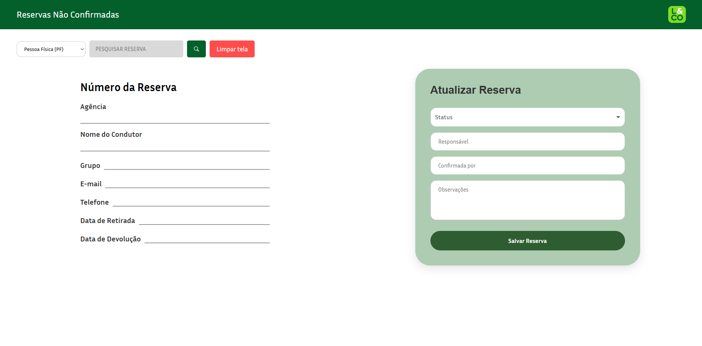

<h1 align="center">Sistema de Tratativa de Reservas Não Confirmadas</h1>

<p align="center">
  <a href="#sobre-o-projeto">Sobre o projeto</a>&nbsp;&nbsp;&nbsp;|&nbsp;&nbsp;&nbsp;
  <a href="#tecnologias-utilizadas">Tecnologias</a>&nbsp;&nbsp;&nbsp;|&nbsp;&nbsp;&nbsp;
  <a href="#como-executar">Execução</a>&nbsp;&nbsp;&nbsp;|&nbsp;&nbsp;&nbsp;
  <a href="#material">Documentação</a>&nbsp;&nbsp;&nbsp;|&nbsp;&nbsp;&nbsp;
  <a href="#layout">Layout</a>
</p>


<br>

<p align="center">
  
</p>

# Sobre o projeto

Aplicação Full Stack desenvolvida para a consulta, gestão e tratamento operacional de reservas não confirmadas ou negadas.

O sistema permite que a equipe operacional pesquise reservas, visualize seus detalhes e registre ou atualize o histórico de tratativas, garantindo o acompanhamento do ciclo de vida das reservas e a mensuração do impacto financeiro recuperado.

# Evolução da Arquitetura
Concebido inicialmente para atender de forma dedicada o segmento Pessoa Jurídica (PJ), o sistema foi posteriormente expandido para suportar também Pessoa Física (PF). 

Essa evolução foi planejada para demonstrar uma arquitetura flexível e escalável, capaz de lidar com regras de negócio distintas para cada segmento (como validação de CPF/CNPJ, e-mails corporativos vs. pessoais e prefixos de cotação diferentes) mantendo a coesão da aplicação.

> ⚠️ **Nota de Privacidade e LGPD:** Todos os dados utilizados no banco de dados (nomes, CPFs, empresas, e-mails, telefones e valores) são 100% fictícios e gerados automaticamente apenas para fins de testes, simulação operacional e demonstração técnica de portfólio.

## Tecnologias utilizadas

### Frontend
- Angular 18
- TypeScript
- SCSS
- Angular Material
- SweetAlert2
- Bootstrap Icons

### Backend
- Python
- FastAPI
- Uvicorn
- Psycopg2

### Banco de dados
- PostgreSQL

## Estrutura do projeto

```text
MEU-PROJETO/
├── backend/
├── frontend/
├── database/
│   ├── schema_v1.0.0.sql
│   └── schema_v1.1.0.sql
├── docs/
├── .gitignore
└── README.md
```

## Como executar

### Frontend

```bash
cd frontend
npm install
ng serve
```

### Backend

```bash
cd backend
pip install fastapi uvicorn psycopg2 pydantic
uvicorn main:app --reload
```

### Banco de dados

Execute o arquivo:

```text
database/schema_v1.1.0.sql
```

em uma instância PostgreSQL para criar as tabelas necessárias para a aplicação.

## Funcionalidades

- Seleção de Segmento: Filtro entre Pessoa Física (PF) e Pessoa Jurídica (PJ).
- Consulta de Reservas: Busca por número identificador.
- Detalhes Condicionais: Exibição de dados conforme o segmento selecionado.
- Gestão de Tratativas: Registro de status, responsáveis e confirmação.
- Gestão Financeira: Registro de novo localizador e valores recuperados.
- Observações Operacionais: Anotações sobre o atendimento.
- Limpeza de Tela: Reset dos dados para novas consultas.


## Material

Para acessar a documentação, acesse o link: [DOCUMENTAÇÃO](./docs/Documentação%20Técnica%20—%20Sistema%20de%20Tratativa%20de%20Reservas%20Não%20Confirmadas.pdf)

## Layout

Você pode visualizar o layout do projeto através [DESSE LINK](https://www.figma.com/design/Gxmx1H5sxs0puKWE1Y6zkR/Software-design?node-id=2001-2&p=f&t=h0sw2VuDRFIP5Dsp-0). É necessário ter conta no [Figma](https://figma.com) para acessá-lo.

## Autor

Desenvolvido por **Beatriz Alves** como projeto de aprendizado e portfólio em desenvolvimento Full Stack.